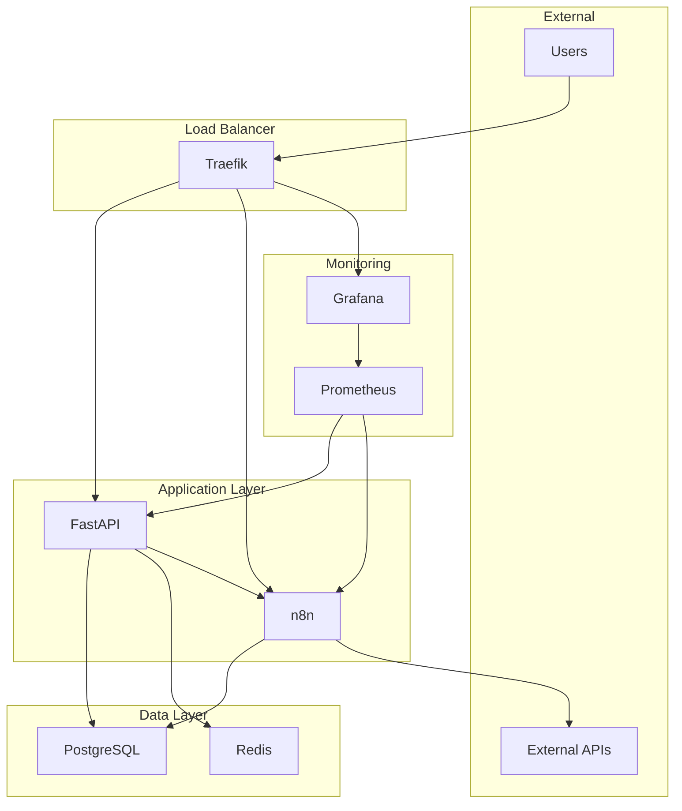

# Unity AI Platform

A comprehensive automation platform combining FastAPI, n8n workflows, and monitoring capabilities for AI-powered business processes.

## 🚀 Quick Start

### Development Environment

```bash
# Clone the repository
git clone https://github.com/Flissel/unityai.git
cd unityai

# Copy environment template
cp .env.example .env

# Start development environment
docker-compose up -d

# Access services
# - FastAPI: http://localhost:8000
# - n8n: http://localhost:5678
# - Grafana: http://localhost:3000
```

### Production Deployment

```bash
# 1. Configure production environment
./scripts/setup-production.sh

# 2. Deploy to production
./scripts/deploy-production.sh

# 3. Access services
# - API: https://api.unit-y-ai.io
# - n8n: https://n8n.unit-y-ai.io
# - Grafana: https://grafana.unit-y-ai.io
```

## 📋 Table of Contents

- [Architecture](#architecture)
- [Features](#features)
- [Prerequisites](#prerequisites)
- [Installation](#installation)
- [Configuration](#configuration)
- [API Documentation](#api-documentation)
- [Monitoring](#monitoring)
- [Security](#security)
- [Deployment](#deployment)
- [Troubleshooting](#troubleshooting)
- [Contributing](#contributing)

## 🏗️ Architecture



## ✨ Features

### Core Platform
- **FastAPI Backend**: High-performance REST API with automatic documentation
- **n8n Workflows**: Visual workflow automation and integration platform
- **PostgreSQL Database**: Reliable data persistence with async support
- **Redis Cache**: High-performance caching and session management
- **Traefik Proxy**: Automatic HTTPS, load balancing, and service discovery

### Security
- **API Key Authentication**: Secure API access control
- **Rate Limiting**: Protection against abuse and DoS attacks
- **CORS Configuration**: Cross-origin request security
- **Input Validation**: Comprehensive request validation with Pydantic
- **Secret Management**: Docker secrets for sensitive data
- **SSL/TLS**: Automatic certificate management with Let's Encrypt

### Monitoring & Observability
- **Prometheus Metrics**: Application and infrastructure monitoring
- **Grafana Dashboards**: Visual monitoring and alerting
- **Health Checks**: Comprehensive service health monitoring
- **Structured Logging**: JSON-formatted logs with correlation IDs
- **Performance Tracking**: Request timing and resource usage metrics

### DevOps & Deployment
- **Docker Containerization**: Consistent deployment across environments
- **GitHub Actions CI/CD**: Automated testing, building, and deployment
- **Multi-stage Builds**: Optimized production images
- **Database Migrations**: Automated schema management with Alembic
- **Backup & Recovery**: Automated database backups with retention
- **Rollback Support**: Quick rollback to previous versions

## 📋 Prerequisites

### Development
- Docker 20.10+
- Docker Compose 2.0+
- Python 3.11+ (for local development)
- Git

### Production
- Linux server (Ubuntu 20.04+ recommended)
- Docker 20.10+
- Docker Compose 2.0+
- Domain name with DNS access
- Cloudflare account (for automatic SSL)
- 4GB+ RAM, 2+ CPU cores
- 50GB+ storage

## 🛠️ Installation

### Local Development

1. **Clone the repository**
   ```bash
   git clone https://github.com/Flissel/unityai.git
   cd unityai
   ```

2. **Set up environment**
   ```bash
   cp .env.example .env
   # Edit .env with your configuration
   ```

3. **Start services**
   ```bash
   docker-compose up -d
   ```

4. **Initialize database**
   ```bash
   docker-compose exec fastapi alembic upgrade head
   ```

### Production Setup

1. **Server preparation**
   ```bash
   # Update system
   sudo apt update && sudo apt upgrade -y
   
   # Install Docker
   curl -fsSL https://get.docker.com -o get-docker.sh
   sudo sh get-docker.sh
   sudo usermod -aG docker $USER
   
   # Install Docker Compose
   sudo curl -L "https://github.com/docker/compose/releases/latest/download/docker-compose-$(uname -s)-$(uname -m)" -o /usr/local/bin/docker-compose
   sudo chmod +x /usr/local/bin/docker-compose
   ```

2. **Deploy application**
   ```bash
   git clone https://github.com/Flissel/unityai.git
   cd unityai
   
   # Configure production environment
   ./scripts/setup-production.sh
   
   # Deploy
   ./scripts/deploy-production.sh
   ```

## ⚙️ Configuration

### Environment Variables

Key configuration options in `.env.production`:

```bash
# Domain Configuration
DOMAIN=unit-y-ai.io
API_DOMAIN=api.unit-y-ai.io
N8N_DOMAIN=n8n.unit-y-ai.io

# Security
SECRET_KEY=your-secret-key-here
API_KEYS=key1,key2,key3

# Database
POSTGRES_PASSWORD=secure-password
DATABASE_URL=postgresql://user:pass@db:5432/unityai

# Redis
REDIS_PASSWORD=secure-password
REDIS_URL=redis://:password@redis:6379/0

# Cloudflare (for SSL)
CLOUDFLARE_EMAIL=your-email@example.com
CLOUDFLARE_TOKEN=your-api-token

# External APIs
OPENAI_API_KEY=your-openai-key
```

### Service Configuration

- **FastAPI**: Configuration in `fastapi/main.py`
- **n8n**: Environment variables in Docker Compose
- **Traefik**: Configuration in `traefik/traefik.yml`
- **Grafana**: Dashboards in `grafana/dashboards/`

## 📚 API Documentation

### Interactive Documentation
- **Swagger UI**: https://api.unit-y-ai.io/docs
- **ReDoc**: https://api.unit-y-ai.io/redoc
- **OpenAPI Schema**: https://api.unit-y-ai.io/openapi.json

### Authentication

All API endpoints require authentication via API key:

```bash
curl -H "X-API-Key: your-api-key" https://api.unit-y-ai.io/api/v1/health
```

### Core Endpoints

- `GET /health` - Health check
- `GET /metrics` - Prometheus metrics
- `POST /api/v1/workflows/trigger` - Trigger n8n workflow
- `GET /api/v1/workflows/{id}/status` - Get workflow status
- `POST /api/v1/data/process` - Process data
- `GET /api/v1/cache/{key}` - Get cached data

## 📊 Monitoring

### Grafana Dashboards

Access monitoring at https://grafana.unit-y-ai.io

**Default Credentials:**
- Username: `admin`
- Password: Set during setup

**Available Dashboards:**
- Application Performance
- Infrastructure Metrics
- n8n Workflow Analytics
- API Usage Statistics
- Error Tracking

### Metrics

- **Application Metrics**: Request rates, response times, error rates
- **Infrastructure Metrics**: CPU, memory, disk, network usage
- **Business Metrics**: Workflow executions, data processing volumes

### Alerts

- High error rates
- Service downtime
- Resource exhaustion
- Failed workflow executions

## 🔒 Security

### Best Practices

1. **Secrets Management**
   - Use Docker secrets for sensitive data
   - Rotate API keys regularly
   - Never commit secrets to version control

2. **Network Security**
   - All traffic encrypted with TLS 1.3
   - Internal service communication via Docker networks
   - Firewall configuration for production

3. **Access Control**
   - API key authentication
   - Rate limiting per client
   - CORS policy enforcement

4. **Monitoring**
   - Security event logging
   - Failed authentication tracking
   - Anomaly detection

### Security Headers

The application includes security headers:
- `X-Content-Type-Options: nosniff`
- `X-Frame-Options: DENY`
- `X-XSS-Protection: 1; mode=block`
- `Strict-Transport-Security: max-age=31536000`

## 🚀 Deployment

### CI/CD Pipeline

GitHub Actions workflow includes:

1. **Code Quality**
   - Linting (flake8, mypy)
   - Formatting (black, isort)
   - Security scanning (bandit, safety)

2. **Testing**
   - Unit tests with pytest
   - Integration tests
   - Coverage reporting

3. **Security**
   - Dependency vulnerability scanning
   - Docker image security scanning
   - SARIF reporting

4. **Deployment**
   - Automated staging deployment
   - Production deployment on release
   - Rollback capability

### Manual Deployment

```bash
# Deploy to production
./scripts/deploy-production.sh

# Check deployment status
./scripts/deploy-production.sh health

# Rollback if needed
./scripts/deploy-production.sh rollback

# Create backup
./scripts/deploy-production.sh backup
```

### Zero-Downtime Deployment

The platform supports zero-downtime deployments using:
- Docker Swarm rolling updates
- Health checks before traffic routing
- Automatic rollback on failure

## 🔧 Troubleshooting

### Common Issues

1. **Service Won't Start**
   ```bash
   # Check logs
   docker-compose logs service-name
   
   # Check service status
   docker-compose ps
   ```

2. **Database Connection Issues**
   ```bash
   # Check database status
   docker-compose exec db pg_isready
   
   # Check connection from app
   docker-compose exec fastapi python -c "import asyncpg; print('OK')"
   ```

3. **SSL Certificate Issues**
   ```bash
   # Check Traefik logs
   docker-compose logs traefik
   
   # Verify DNS configuration
   nslookup api.unit-y-ai.io
   ```

4. **Performance Issues**
   ```bash
   # Check resource usage
   docker stats
   
   # Check application metrics
   curl https://api.unit-y-ai.io/metrics
   ```

### Log Locations

- **Application Logs**: `docker-compose logs fastapi`
- **n8n Logs**: `docker-compose logs n8n`
- **Database Logs**: `docker-compose logs db`
- **Proxy Logs**: `docker-compose logs traefik`
- **System Logs**: `/var/log/unityai/`

### Health Checks

```bash
# Check all services
curl https://api.unit-y-ai.io/health
curl https://n8n.unit-y-ai.io/healthz
curl https://grafana.unit-y-ai.io/api/health

# Check internal services
docker-compose exec fastapi curl http://localhost:8000/health
docker-compose exec n8n curl http://localhost:5678/healthz
```

## 🤝 Contributing

### Development Setup

1. **Fork and clone**
   ```bash
   git clone https://github.com/yourusername/unityai.git
   cd unityai
   ```

2. **Set up development environment**
   ```bash
   python -m venv venv
   source venv/bin/activate  # On Windows: venv\Scripts\activate
   pip install -r fastapi/requirements.txt
   ```

3. **Run tests**
   ```bash
   pytest tests/ -v
   ```

4. **Code formatting**
   ```bash
   black fastapi/
   isort fastapi/
   flake8 fastapi/
   ```

### Pull Request Process

1. Create feature branch
2. Make changes with tests
3. Ensure all checks pass
4. Submit pull request
5. Code review and merge

### Code Standards

- Follow PEP 8 style guide
- Write comprehensive tests
- Document all functions and classes
- Use type hints
- Keep functions small and focused

## 📄 License

This project is licensed under the MIT License - see the [LICENSE](LICENSE) file for details.

## 🆘 Support

- **Documentation**: [Wiki](https://github.com/Flissel/unityai/wiki)
- **Issues**: [GitHub Issues](https://github.com/Flissel/unityai/issues)
- **Discussions**: [GitHub Discussions](https://github.com/Flissel/unityai/discussions)

## 🗺️ Roadmap

- [ ] Advanced workflow templates
- [ ] Multi-tenant support
- [ ] Enhanced monitoring dashboards
- [ ] API rate limiting improvements
- [ ] Machine learning model integration
- [ ] Advanced caching strategies
- [ ] Kubernetes deployment support

---

**Unity AI Platform** - Empowering automation with AI-driven workflows.