# Unity AI Platform - Mermaid Architecture Diagrams

## System Architecture Overview

```mermaid
graph TB
    %% External Layer
    Internet[🌐 Internet]
    Users[👥 Users]
    Clients[🔌 API Clients]
    Webhooks[🪝 Webhooks]
    
    %% Reverse Proxy Layer
    subgraph "Reverse Proxy & Load Balancing"
        Traefik[🚦 Traefik<br/>SSL/TLS Termination<br/>Load Balancing<br/>Service Discovery<br/>Rate Limiting]
    end
    
    %% Application Services Layer
    subgraph "Application Services"
        UnityAI[🚀 Unity AI App<br/>FastAPI Application<br/>REST API Endpoints<br/>Authentication<br/>Business Logic]
        N8NCore[⚙️ n8n Core<br/>Workflow Engine<br/>Web Interface<br/>Workflow Management<br/>Scheduler]
        N8NWorker[👷 n8n Worker<br/>Queue Worker<br/>Workflow Execution<br/>ML Libraries<br/>Python Scripts]
        PythonWorker[🐍 Python Worker<br/>Background Tasks<br/>Data Processing<br/>ML Inference<br/>Script Execution]
    end
    
    %% Shared Resources
    subgraph "Shared Scripts & Libraries"
        DataScripts[📊 Data Processing]
        MLScripts[🤖 ML Inference]
        ScrapingScripts[🕷️ Web Scraping]
        DocScripts[📄 Document Processing]
        ImgScripts[🖼️ Image Processing]
        APIScripts[🔗 API Integration]
        NotificationScripts[📢 Notifications]
        CommonLibs[📚 Common Libraries]
    end
    
    %% Data & Queue Layer
    subgraph "Data & Queue Layer"
        Postgres[(🐘 PostgreSQL<br/>Primary Database<br/>n8n Workflows<br/>User Data<br/>Configuration)]
        Redis[(🔴 Redis<br/>Queue Management<br/>Session Storage<br/>Caching<br/>Pub/Sub)]
        Volumes[(💾 Docker Volumes<br/>Persistent Storage<br/>File Uploads<br/>Logs<br/>Backups)]
    end
    
    %% Monitoring Layer
    subgraph "Monitoring & Observability"
        Prometheus[📈 Prometheus<br/>Metrics Collection<br/>Time Series DB<br/>Alerting Rules]
        Grafana[📊 Grafana<br/>Dashboards<br/>Visualization<br/>Alerting<br/>Reporting]
        Logs[📝 Logs<br/>Centralized Logging<br/>Log Aggregation<br/>Log Analysis]
    end
    
    %% Security Layer
    subgraph "Security & Configuration"
        Secrets[🔐 Docker Secrets]
        EnvFiles[⚙️ Environment Files]
        Certificates[🔒 SSL/TLS Certificates]
        Auth[🛡️ Authentication]
        RateLimit[⏱️ Rate Limiting]
    end
    
    %% Network Layer
    subgraph "Docker Network"
        Network[🌐 Overlay Network<br/>Service Discovery<br/>Internal Communication<br/>Network Isolation]
    end
    
    %% External Connections
    Internet --> Traefik
    Users --> Traefik
    Clients --> Traefik
    Webhooks --> Traefik
    
    %% Traefik Routing
    Traefik --> UnityAI
    Traefik --> N8NCore
    Traefik --> Grafana
    
    %% Application Service Connections
    UnityAI --> Postgres
    UnityAI --> Redis
    UnityAI --> PythonWorker
    
    N8NCore --> Postgres
    N8NCore --> Redis
    N8NCore --> N8NWorker
    
    N8NWorker --> Redis
    N8NWorker --> DataScripts
    N8NWorker --> MLScripts
    N8NWorker --> ScrapingScripts
    N8NWorker --> DocScripts
    N8NWorker --> ImgScripts
    N8NWorker --> APIScripts
    N8NWorker --> NotificationScripts
    
    PythonWorker --> Redis
    PythonWorker --> Postgres
    PythonWorker --> CommonLibs
    
    %% Shared Resources Dependencies
    DataScripts --> CommonLibs
    MLScripts --> CommonLibs
    ScrapingScripts --> CommonLibs
    DocScripts --> CommonLibs
    ImgScripts --> CommonLibs
    APIScripts --> CommonLibs
    NotificationScripts --> CommonLibs
    
    %% Monitoring Connections
    Prometheus --> UnityAI
    Prometheus --> N8NCore
    Prometheus --> N8NWorker
    Prometheus --> PythonWorker
    Prometheus --> Postgres
    Prometheus --> Redis
    Prometheus --> Traefik
    
    Grafana --> Prometheus
    Logs --> UnityAI
    Logs --> N8NCore
    Logs --> N8NWorker
    Logs --> PythonWorker
    
    %% Security Connections
    Secrets --> UnityAI
    Secrets --> N8NCore
    Secrets --> Postgres
    EnvFiles --> UnityAI
    EnvFiles --> N8NCore
    Certificates --> Traefik
    Auth --> Traefik
    RateLimit --> Traefik
    
    %% Network Layer
    Network --> UnityAI
    Network --> N8NCore
    Network --> N8NWorker
    Network --> PythonWorker
    Network --> Postgres
    Network --> Redis
    Network --> Prometheus
    Network --> Grafana
    
    %% Styling
    classDef external fill:#e1f5fe,stroke:#01579b,stroke-width:2px
    classDef proxy fill:#f3e5f5,stroke:#4a148c,stroke-width:2px
    classDef app fill:#e8f5e8,stroke:#1b5e20,stroke-width:2px
    classDef data fill:#fff3e0,stroke:#e65100,stroke-width:2px
    classDef monitor fill:#fce4ec,stroke:#880e4f,stroke-width:2px
    classDef security fill:#f1f8e9,stroke:#33691e,stroke-width:2px
    classDef network fill:#e0f2f1,stroke:#004d40,stroke-width:2px
    classDef shared fill:#f9fbe7,stroke:#827717,stroke-width:2px
    
    class Internet,Users,Clients,Webhooks external
    class Traefik proxy
    class UnityAI,N8NCore,N8NWorker,PythonWorker app
    class Postgres,Redis,Volumes data
    class Prometheus,Grafana,Logs monitor
    class Secrets,EnvFiles,Certificates,Auth,RateLimit security
    class Network network
    class DataScripts,MLScripts,ScrapingScripts,DocScripts,ImgScripts,APIScripts,NotificationScripts,CommonLibs shared
```

## Data Flow Sequence Diagram

## Container Deployment Diagram

## Service Dependencies

## Network Architecture

## Technology Stack Mind Map

## Script Integration Flow

