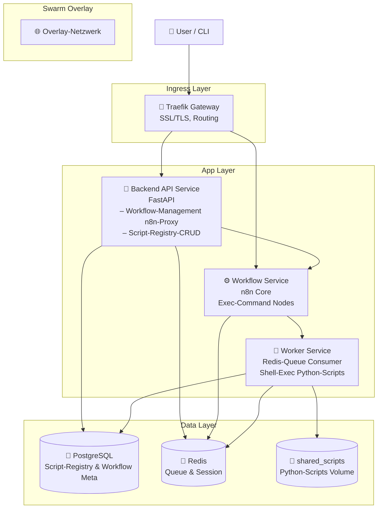
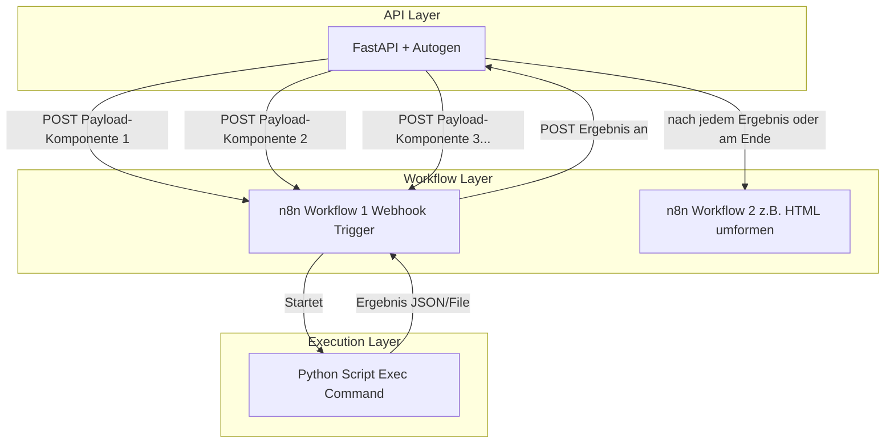
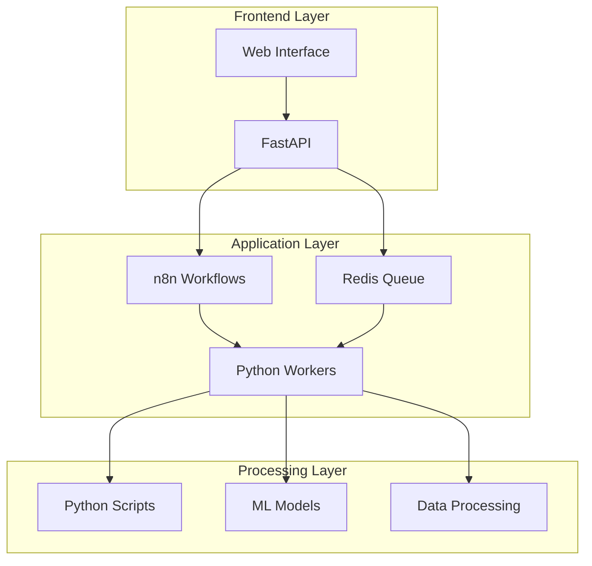
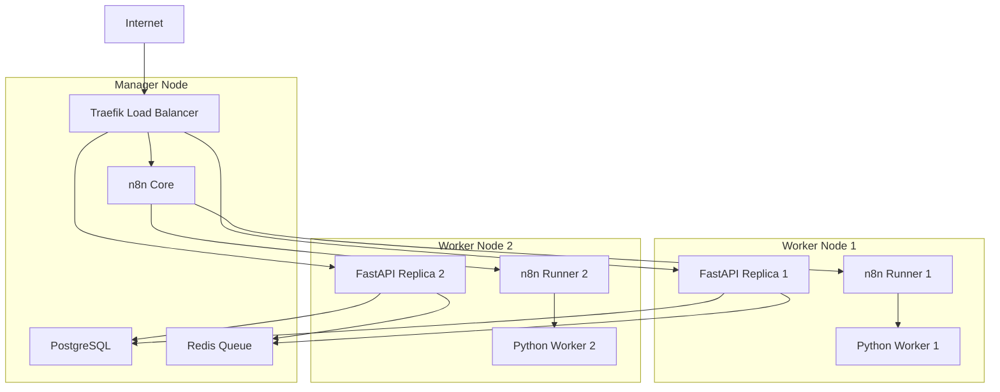
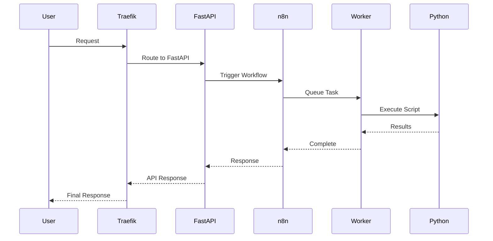

# Unity AI Platform - Simplified Architecture

A simplified overview of the Unity AI platform's core components and data flow.

## Architektur-Grundstruktur

### n8n als Orchestrator
Workflows dienen als "Jobs" und steuern Ausführung, Kettenbildung und Übergabe.

### Python Scripts via Execute Command
Skripte werden über den Exec Command Node ausgeführt, der Pfad und Parameter übernimmt. Damit können beliebige Simulationen, ML, Datenprozesse usw. außerhalb der eigentlichen n8n-Engine laufen.

### Webhook-Triggers für Skalierbarkeit
Jeder Workflow kann (und sollte für asynchrone Jobs) einen eigenen Webhook-Trigger erhalten, um von außen ausgelöst zu werden (z. B. per FastAPI).

### FastAPI + Autogen
Steuert das Anstoßen und die Koordination der Workflows, verteilt Aufgaben (bspw. teilt große Tasks auf viele Jobs auf).

## Core System Overview



## Praktische Umsetzung (Step-by-Step)

### 1. Python Scripts via n8n Execute Command
- **Integration:** Python-Skripte werden über n8n's "Execute Command" Nodes ausgeführt
- **Vorteile:** Direkte Integration, einfache Parameter-Übergabe, Logging
- **Verwendung:** Datenverarbeitung, API-Calls, Berechnungen
- **Swarm-Deployment:** Skripte werden auf Worker-Nodes ausgeführt

### 2. Workflow Design mit n8n und Webhooks
- **Trigger:** HTTP Webhook Nodes als Einstiegspunkte
- **Orchestrierung:** n8n koordiniert die Ausführung verschiedener Python-Skripte
- **Monitoring:** Eingebaute Execution-Historie und Error-Handling
- **High Availability:** n8n läuft als Swarm Service mit Restart-Policy

### 3. Verteilung/Parallelisierung via FastAPI
- **Load Balancing:** FastAPI ruft n8n Webhooks auf verschiedenen Instanzen auf
- **Skalierung:** Horizontale Skalierung durch mehrere n8n Worker und FastAPI Replicas
- **Queue Management:** Redis als Message Broker für Task-Verteilung
- **Service Discovery:** Docker Swarm's integrierte Service-Discovery

### 4. Ergebnis-Verarbeitung
- **Rückgabe:** Python-Skripte geben Ergebnisse an n8n zurück
- **Weiterleitung:** n8n leitet Ergebnisse an FastAPI weiter
- **Persistierung:** Ergebnisse werden in PostgreSQL gespeichert
- **Redundanz:** Daten werden über Swarm Volumes persistent gespeichert

### 5. Docker Swarm Deployment
- **Orchestrierung:** Docker Swarm verwaltet Service-Deployment und -Skalierung
- **Load Balancing:** Traefik als Reverse Proxy mit automatischer Service-Discovery
- **SSL/TLS:** Automatische Zertifikatserstellung über Let's Encrypt
- **Health Monitoring:** Integrierte Health Checks für Service-Überwachung
- **Secrets Management:** Docker Secrets für sichere Passwort-Verwaltung

## Workflow-Flussdiagramm



## Service Stack



## Docker Swarm Architektur

### Service-Verteilung



### Deployment-Konfiguration

| Service | Replicas | Placement | Resources |
|---------|----------|-----------|----------|
| Traefik | 1 | Manager Node | 256MB RAM |
| PostgreSQL | 1 | Manager Node | 512MB RAM |
| Redis | 1 | Manager Node | 256MB RAM |
| n8n Core | 1 | Manager Node | 1GB RAM |
| FastAPI | 2 | Worker Nodes | 1GB RAM each |
| Python Worker | 3 | Worker Nodes | 2GB RAM each |
| n8n Runner | 2 | Worker Nodes | 512MB RAM each |


## Data Flow



## Quick Start Guide

### Development
```bash
# Start development environment
docker-compose up -d

# Access services
# FastAPI: http://localhost:8000
# n8n: http://localhost:5678

```

### Production
```bash
# Deploy to production
docker-compose -f docker-compose.prod.yml up -d

# Monitor logs
docker-compose logs -f
```

## Key Features

- 🔄 **Automated Workflows**: n8n for complex automation
- ⚡ **Fast API**: High-performance REST endpoints
- 📦 **Caching**: Redis for improved performance
- 🗄️ **Persistence**: PostgreSQL for reliable data storage
- 📊 **Monitoring**: Application observability
- 🌐 **Load Balancing**: Traefik reverse proxy
- 🐍 **Extensible**: Python scripts for custom logic

---

*For detailed architecture diagrams, see:*
- [Detailed Mermaid Diagrams](./architecture-mermaid.md)
- [Professional PlantUML Diagrams](./architecture-plantuml.puml)