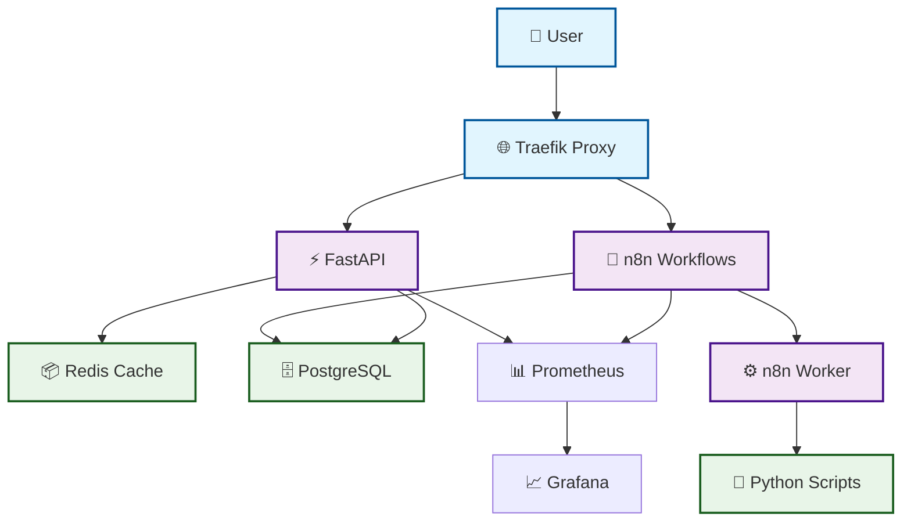
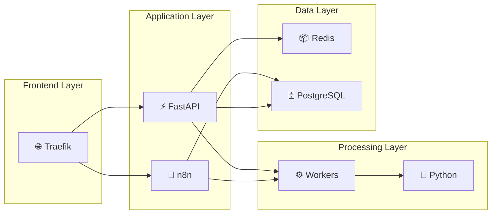
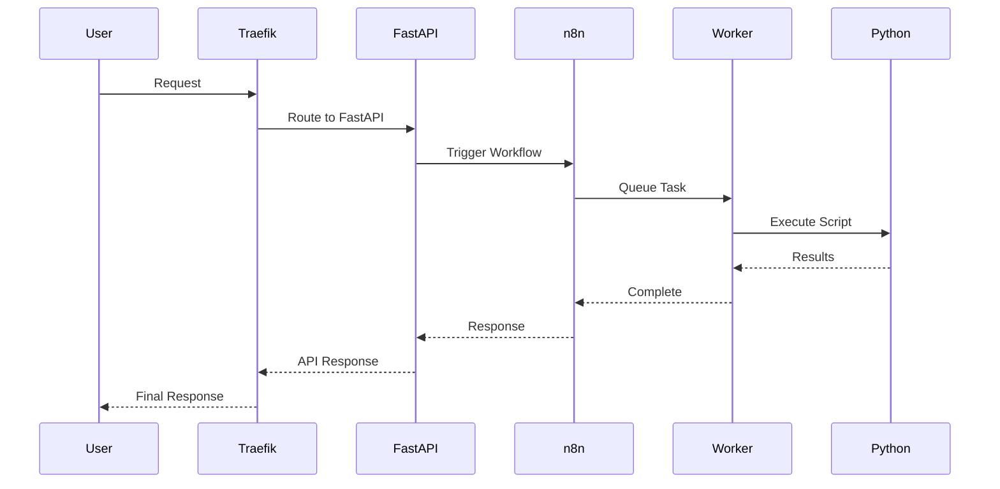

# Unity AI Platform - Simplified Architecture

A simplified overview of the Unity AI platform's core components and data flow.

## Core System Overview



## Service Stack



## Data Flow



## Quick Start Guide

### Development
```bash
# Start development environment
docker-compose up -d

# Access services
# FastAPI: http://localhost:8000
# n8n: http://localhost:5678
# Grafana: http://localhost:3000
```

### Production
```bash
# Deploy to production
docker-compose -f docker-compose.prod.yml up -d

# Monitor logs
docker-compose logs -f
```

## Key Features

- 🔄 **Automated Workflows**: n8n for complex automation
- ⚡ **Fast API**: High-performance REST endpoints
- 📦 **Caching**: Redis for improved performance
- 🗄️ **Persistence**: PostgreSQL for reliable data storage
- 📊 **Monitoring**: Prometheus + Grafana observability
- 🌐 **Load Balancing**: Traefik reverse proxy
- 🐍 **Extensible**: Python scripts for custom logic

---

*For detailed architecture diagrams, see:*
- [Detailed Mermaid Diagrams](./architecture-mermaid.md)
- [Professional PlantUML Diagrams](./architecture-plantuml.puml)