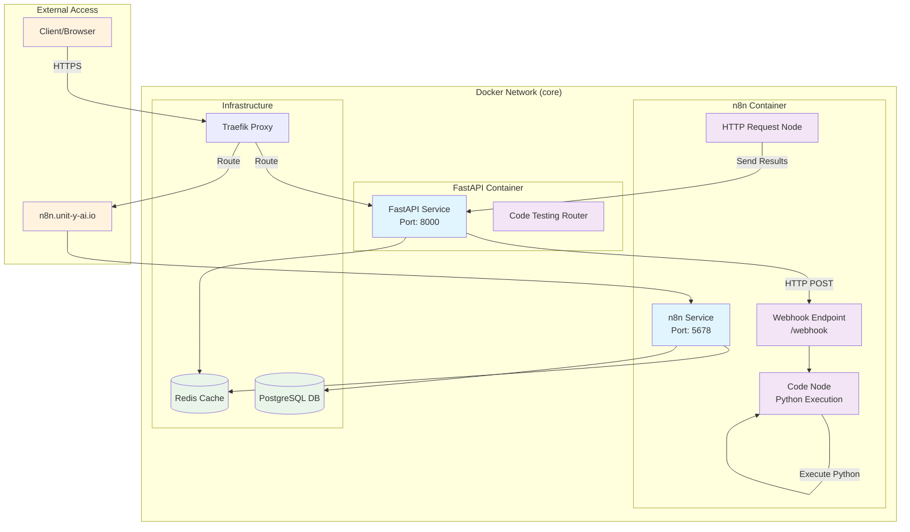
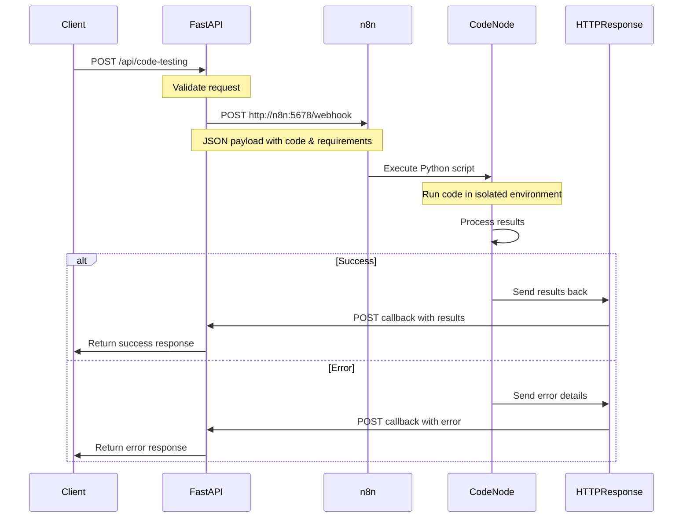
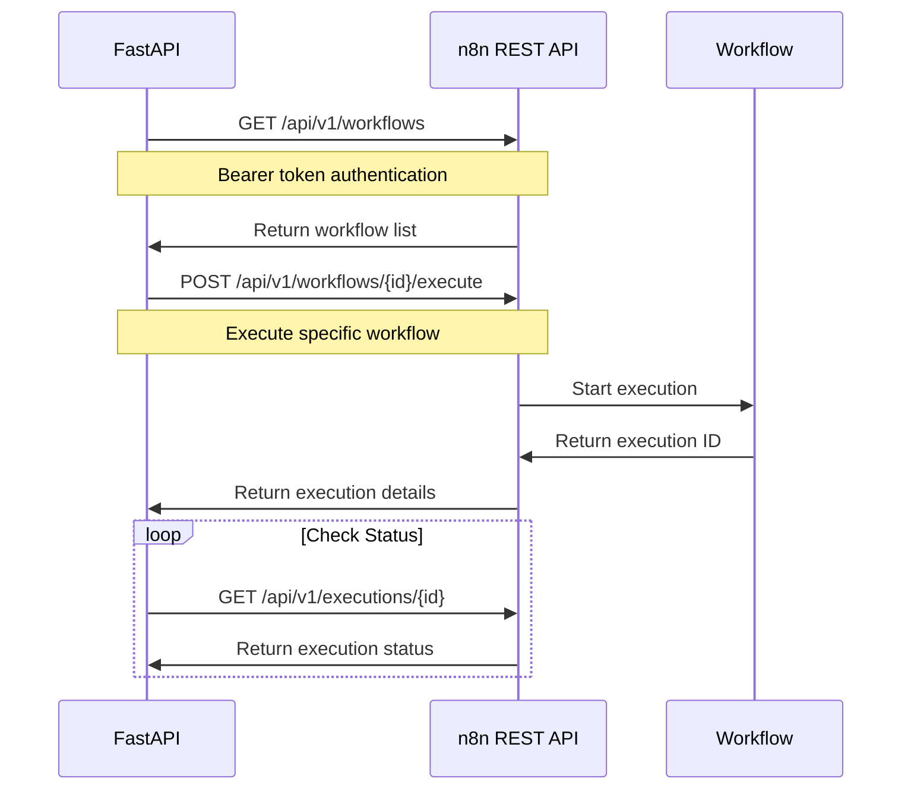
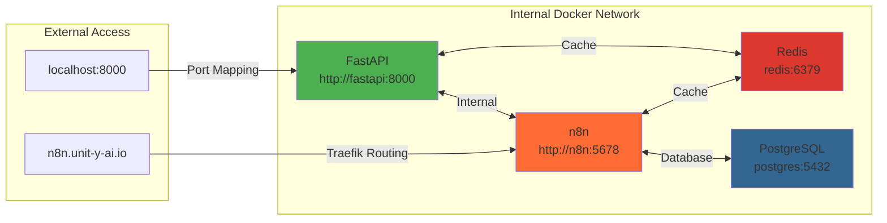
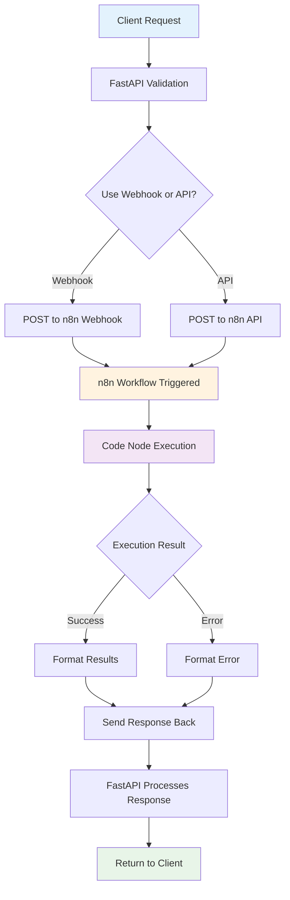
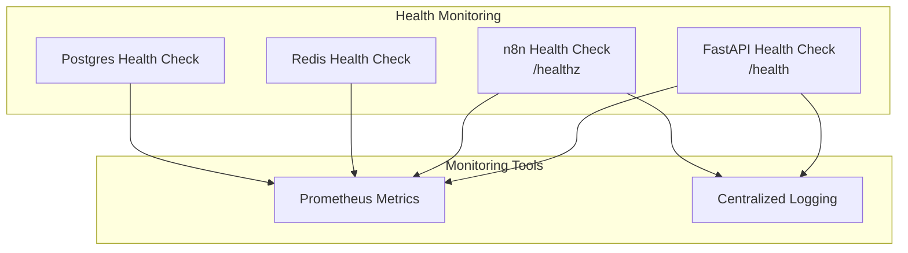

# Communication Protocol - FastAPI ↔ n8n

This document describes the communication protocol between the FastAPI service and n8n workflows within the Docker environment.

## Architecture Overview



## Communication Protocols

### 1. FastAPI → n8n (Webhook Trigger)



### 2. FastAPI → n8n (API Calls)



### 3. Network Communication Details



## Environment Configuration

### FastAPI Environment (.env.fastapi)
```bash
# n8n Communication
N8N_API_URL=http://n8n:5678/api/v1
N8N_API_KEY=your_api_key_here
N8N_WEBHOOK_URL=http://n8n:5678/webhook
```

### n8n Environment (.env.endpoints)
```bash
# Webhook Configuration
N8N_ENDPOINT_WEBHOOK=/webhook
N8N_ENDPOINT_WEBHOOK_TEST=/webhook-test
```

## Data Flow Patterns

### Code Testing Workflow



## Security Considerations

1. **Internal Network**: All services communicate within the Docker `core` network
2. **API Authentication**: n8n API calls require Bearer token authentication
3. **Webhook Security**: Consider implementing webhook signatures for production
4. **Environment Variables**: Sensitive data stored in environment files
5. **Traefik Routing**: External access controlled through Traefik proxy

## Monitoring & Health Checks



## Troubleshooting

### Common Issues
1. **Connection Refused**: Check if services are on the same Docker network
2. **Authentication Failed**: Verify n8n API key configuration
3. **Webhook Not Triggered**: Ensure webhook URL is correct and workflow is active
4. **Timeout Issues**: Check network connectivity and service health

### Debug Commands
```bash
# Check service connectivity
docker-compose exec fastapi curl http://n8n:5678/healthz

# View service logs
docker-compose logs fastapi
docker-compose logs n8n

# Check network configuration
docker network inspect unityai_core
```