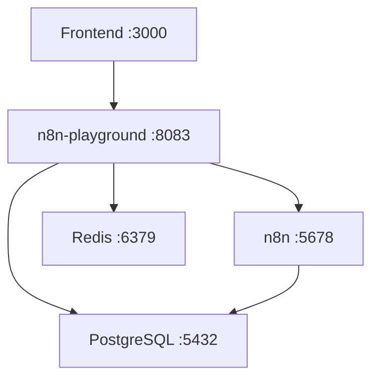

# n8n-playground Full Stack Setup

This setup provides an automated way to run the complete n8n-playground stack with frontend and backend services properly connected.

## 🚀 Quick Start

### Prerequisites
- Docker Desktop installed and running
- PowerShell (Windows) or Bash (Linux/Mac)

### Start the Full Stack

```powershell
# Windows (PowerShell)
.\start-full-stack.ps1
```

```bash
# Linux/Mac (coming soon)
./start-full-stack.sh
```

### Stop the Full Stack

```powershell
# Windows (PowerShell)
.\stop-full-stack.ps1
```

## 📋 What's Included

The full stack includes:

- **Frontend (React)** - Port 3000
- **n8n-playground API** - Port 8083
- **n8n Workflow Engine** - Port 5678
- **PostgreSQL Database** - Port 5432
- **Redis Cache** - Port 6379

## 🔗 Service URLs

| Service | URL | Description |
|---------|-----|-------------|
| Frontend | http://localhost:3000 | React application |
| n8n-playground API | http://localhost:8083 | FastAPI backend |
| API Documentation | http://localhost:8083/docs | Swagger UI |
| n8n Workflow Engine | http://localhost:5678 | n8n interface |
| Database | localhost:5432 | PostgreSQL |
| Redis | localhost:6379 | Redis cache |

## 🔑 Default Credentials

- **n8n**: admin / admin123
- **Database**: postgres / password

## 🔧 Configuration

### Environment Variables

The setup uses a `.env` file for configuration. If it doesn't exist, it will be created from `.env.example`.

Key variables:
- `N8N_API_KEY` - API key for n8n integration
- `FASTAPI_API_KEY` - API key for FastAPI integration
- `JWT_SECRET_KEY` - Secret key for JWT tokens

### Frontend-Backend Connection

The frontend is automatically configured to connect to the n8n-playground API:
- **Proxy Configuration**: `http://localhost:8083`
- **Environment Variables**: Set in docker-compose.full-stack.yml

## 🐳 Docker Compose Details

### Services Architecture



### Network Configuration

All services run on the `n8n-playground-network` bridge network with subnet `172.20.0.0/16`.

### Volume Persistence

- `postgres_data` - Database data
- `redis_data` - Redis data
- `n8n_data` - n8n workflows and settings

## 🛠️ Development

### Hot Reload

Both frontend and backend support hot reload:
- **Frontend**: React hot reload enabled
- **Backend**: Volume mounted for live code changes

### Logs

```powershell
# View all logs
docker-compose -f docker-compose.full-stack.yml logs -f

# View specific service logs
docker-compose -f docker-compose.full-stack.yml logs -f frontend
docker-compose -f docker-compose.full-stack.yml logs -f n8n-playground
```

### Debugging

```powershell
# Check service status
docker-compose -f docker-compose.full-stack.yml ps

# Access service shell
docker-compose -f docker-compose.full-stack.yml exec frontend sh
docker-compose -f docker-compose.full-stack.yml exec n8n-playground bash
```

## 🔄 Manual Commands

If you prefer manual control:

```powershell
# Start services
docker-compose -f docker-compose.full-stack.yml up -d

# Stop services
docker-compose -f docker-compose.full-stack.yml down

# Rebuild and start
docker-compose -f docker-compose.full-stack.yml up --build -d

# Remove volumes (clean slate)
docker-compose -f docker-compose.full-stack.yml down -v
```

## 🚨 Troubleshooting

### Common Issues

1. **Port Conflicts**
   - Ensure ports 3000, 5678, 8083, 5432, 6379 are available
   - Stop other services using these ports

2. **Docker Not Running**
   - Start Docker Desktop
   - Verify with `docker info`

3. **Environment Variables**
   - Check `.env` file exists and has correct values
   - Restart services after changing environment variables

4. **Frontend Proxy Errors**
   - Ensure n8n-playground API is running on port 8083
   - Check network connectivity between services

### Health Checks

All services include health checks:
- Frontend: HTTP check on port 3000
- n8n-playground: HTTP check on `/health` endpoint
- n8n: HTTP check on `/healthz` endpoint
- PostgreSQL: `pg_isready` check
- Redis: `ping` check

## 📚 Additional Resources

- [n8n Documentation](https://docs.n8n.io/)
- [FastAPI Documentation](https://fastapi.tiangolo.com/)
- [React Documentation](https://reactjs.org/docs/)
- [Docker Compose Documentation](https://docs.docker.com/compose/)

## 🤝 Contributing

To contribute to this setup:
1. Test changes with the full stack
2. Update documentation as needed
3. Ensure all services start and connect properly
4. Verify health checks pass